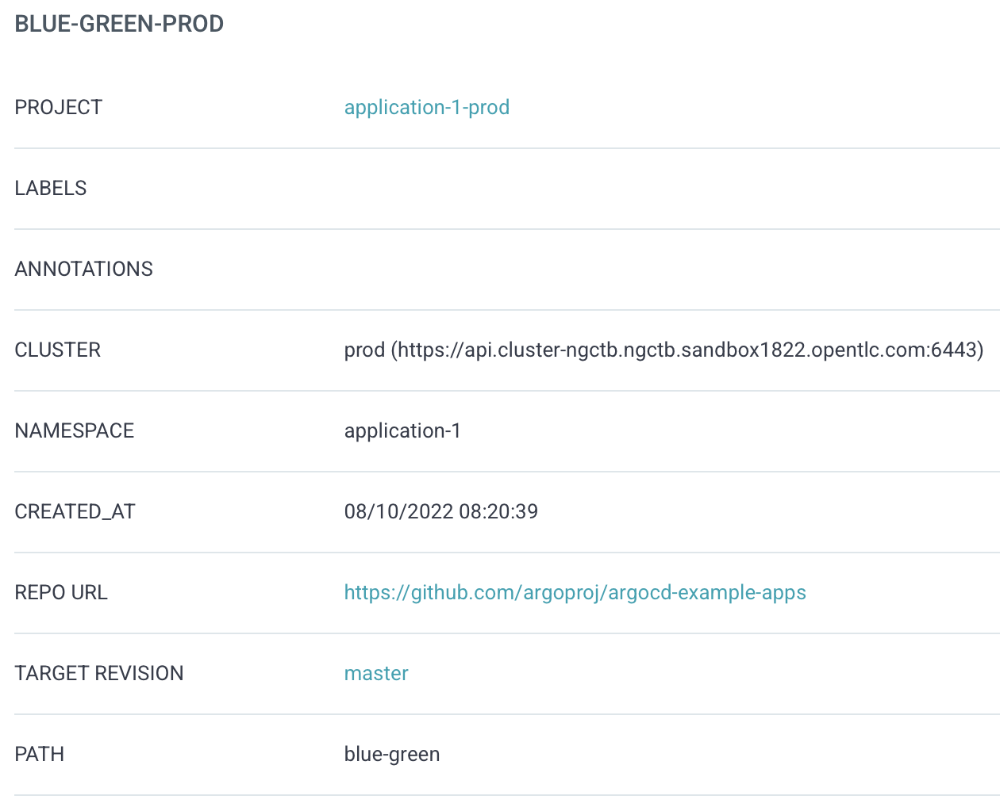
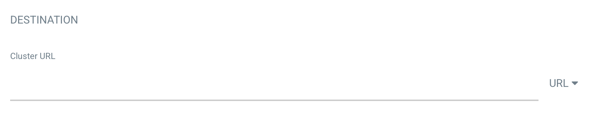

# Gitops/ArgoCD RBAC Example

## Introduction
One of the first questions I am getting asked when setting up OpenShift-Gitops (based on ArgoCD) are: 

*"How do I use it for automatic onboarding new projects and how can I limit access to the different clusters and different teams"*

While there are different approaches, I usually suggest the following: 

Use one instance to manage the configuration of the cluster(s) (let’s call it **management gitops**) and use a separate GitOps instance to deploy the actual workload, the applications (let’s call it **application gitops**). 

This could be one instance for multiple applications, or one instance per team. The advantages here are that you can separate cluster basic configuration and the setup of new namespaces with the deployment of the workload. The cons however are that you need to manage multiple instances. 

To summarize this setup: 
1. Gitops instance that is solely responsible for cluster configuration and thus will take care of the creation of objects like: *Namespaces*, *NetworkPolicies* or *Quotas* that define the boundaries of a new application
2. Gitops instance for the application instance, where developers can deploy their workload and test new features. 

In addition, we have 2 clusters, that can both be managed by the Gitops instances: 

- **DEV**: to let developers to their tests
- **PROD**: for our production workload

## Use Cases
Imagine there are multiple teams, let's say a developer called **Mona** and an operating engineer called **Peter**.

Mona would like to use Gitops to deploy her application on to the DEV cluster to test and verify new features. However, she should only see the DEV cluster and should not be able to deploy anything on to the productive cluster (PROD). Instead, Peter will take the tested application and deploys it to production. Peter is also able to see the deployment done by Mona but should not be able to change or modify anything.  

This boils down to:

- Mona and Peter are using the application Gitops instance
- Mona can deploy to the DEV cluster
- Mona cannot deploy to the PROD cluster
- Mona should not be able to see the Peter’s Gitops application
- Mona should not be able to see other clusters
- Peter should be able to deploy onto PROD
- Peter should be able to see (view) Mona’s application but should not be able to modify it

We will leverage Rolled Based Access Control (RBAC) for ArgoCD/Gitops to achieve these requirements.  

ArgoCD allows us to define RBAC policies on the operator level (for instance-wide rules) as well as on the ArgoCD Project object. 

Both possibilities will be used to limit the access to the application and the clusters accordingly.

## What is an ArgoCD Project? 
To quote from the official [ArgoCD documentation](https://argo-cd.readthedocs.io/en/stable/user-guide/projects/):

> Projects provide a logical grouping of applications, which is useful when Argo CD is used by multiple teams. Projects provide the following features:
>
> - restrict what may be deployed (trusted Git source repositories)
> - restrict where apps may be deployed to (destination clusters and namespaces)
> - restrict what kinds of objects may or may not be deployed (e.g., RBAC, CRDs, > DaemonSets, NetworkPolicy etc...)
> - defining project roles to provide application RBAC (bound to OIDC groups and/or JWT tokens)

## Prerequisites and assumptions

> **CAUTION**: All preparation and configuration are done on the DEV (== Management) cluster and the Gitops Application instance, unless otherwise mentioned.

The following must be met prior the configuration of the RBAC policies: 

- 2 OpenShift clusters
  - 1 Management Cluster (== DEV Cluster): 
    with 2 independent Openshift-Gitops instances are running:
    - Management Instance (namespace: openshift-gitops): to configure the two clusters
    - Application instance (namespace: gitops-application): to deploy the applications to the two clusters

> NOTE: The following Helm chart can help you deploying the additional ArgoCD instance: https://github.com/tjungbauer/openshift-cluster-bootstrap/tree/main/clusters/management-cluster/management-gitops 

- The users **mona** and **peter** can authenticate, and they are assigned to the appropriate groups (see section Users and Groups) 
- The clusters have been added to both GitOps instances: For the management instance, this is done automatically (in-cluster), for the 2nd instance the following command can be used:

`argocd cluster add <CONTEXT NAME> --name PROD`

> **CAUTION**: You need to be logged in to the appropriate ArgoCD instance. 

> **NOTE**: Above command will create: 
>- Service Account “argocd-manager” to the namespace “kube-system”
>-	ClusterRole argocd-manager-role
>-	ClusterRoleBinding "argocd-manager-role-binding"

Once added, you should see them in both Gitops instances:


## Project onboarding

Now let’s start with the project onboarding and the setup of the ArgoCD Projects.

Before an application can be deployed a namespace must be created. Beside the actual Namespace object other configuration like *Quotas*, *NetworkPolicies* and so on can be done. 

The Namespace for our application, called **application-1** is simply created by (labels are cut): 

```
apiVersion: v1
kind: Namespace
metadata:
  name: application-1
```

## Users and Groups
To authenticate against ArgoCD and use RBAC rules two users and two groups are be created in our example.

- User **mona** is part of the group **application-1-dev**
- User **peter** is part of the group **application-1-ops**

These groups can be created with the following yaml: 

```
apiVersion: user.openshift.io/v1
kind: Group
metadata:
  name: application-1-dev
users:
  - mona
---
apiVersion: user.openshift.io/v1
kind: Group
metadata:
  name: application-1-ops
users:
  - peter
```

At this moment Mona and Peter should be able to login to BOTH Gitops instances, but limited to read-only permission.

The next step is to create policies and roles for ArgoCD. Let’s start with the application instance. 

## RBAC Configuration for Application Gitops:
On the application Gitops instance we create two ArgoCD project objects. With these we can define RBAC policies and limit the access to specific repositories or resources. 

Let’s create the following two AppProjects:

- application-1-dev: used for DEV deployments
- application-1-ops: used for PROD deployments

```
apiVersion: argoproj.io/v1alpha1
kind: AppProject
metadata:
  name: application-1-dev
  namespace: gitops-application
spec:
  clusterResourceWhitelist:
    - group: '*'
      kind: '*'
  description: application-1 GitOps Project
  destinations:
    - name: in-cluster
      namespace: application-1
      server: 'https://kubernetes.default.svc'
  roles:
    - description: Group to developers to deploy on DEV environment
      groups:
        - application-1-dev
      name: developers
      policies:
        - >-
          p, proj:application-1-dev:developers, applications, get,
          application-1-dev/*, allow
        - >-
          p, proj:application-1-dev:developers, applications, create,
          application-1-dev/*, allow
        - >-
          p, proj:application-1-dev:developers, applications, update,
          application-1-dev/*, allow
        - >-
          p, proj:application-1-dev:developers, applications, delete,
          application-1-dev/*, allow
        - >-
          p, proj:application-1-dev:developers, applications, sync,
          application-1-dev/*, allow
        - >-
          p, proj:application-1-dev:developers, applications, override,
          application-1-dev/*, allow
    - description: Group for production deployment
      groups:
        - application-1-ops
      name: production-rollout
      policies:
        - >-
          p, proj:application-1-dev:production-rollout, applications, get,
          application-1-dev/*, allow
        - >-
          p, proj:application-1-dev:production-rollout, applications, create,
          application-1-dev/*, deny
        - >-
          p, proj:application-1-dev:production-rollout, applications, update,
          application-1-dev/*, deny
        - >-
          p, proj:application-1-dev:production-rollout, applications, delete,
          application-1-dev/*, deny
        - >-
          p, proj:application-1-dev:production-rollout, applications, sync,
          application-1-dev/*, deny
        - >-
          p, proj:application-1-dev:production-rollout, applications, override,
          application-1-dev/*, deny
  sourceRepos:
    - 'https://github.com/argoproj/argocd-example-apps'
--- 
apiVersion: argoproj.io/v1alpha1
kind: AppProject
metadata:
  name: application-1-prod
  namespace: gitops-application
spec:
  clusterResourceWhitelist:
    - group: '*'
      kind: '*'
  description: application-1 GitOps Project
  destinations:
    - name: prod
      namespace: application-1
      server: 'https://api.cluster-qf5g6.qf5g6.sandbox389.opentlc.com:6443'
  roles:
    - description: Group for production deployment
      groups:
        - application-1-ops
      name: production-rollout
      policies:
        - >-
          p, proj:application-1-prod:production-rollout, applications, get,
          application-1-prod/*, allow
        - >-
          p, proj:application-1-prod:production-rollout, applications, create,
          application-1-prod/*, allow
        - >-
          p, proj:application-1-prod:production-rollout, applications, update,
          application-1-prod/*, allow
        - >-
          p, proj:application-1-prod:production-rollout, applications, delete,
          application-1-prod/*, allow
        - >-
          p, proj:application-1-prod:production-rollout, applications, sync,
          application-1-prod/*, allow
        - >-
          p, proj:application-1-prod:production-rollout, applications, override,
          application-1-prod/*, allow
  sourceRepos:
    - 'https://github.com/argoproj/argocd-example-apps'
```

The application assigned to these projects will be limited to:

- Both: Only allow the repository: 'https://github.com/argoproj/argocd-example-apps'
- AppProject *application-1-dev*: 
  - Allows only **in-cluster** deployment (== DEV Cluster) 
  - Assigns a policy to the groups: \
    **application-1-dev** and **application-1-ops**. Developers are allowed to perform all operations on *applications*, while operators can only see but not modify or delete them 
- AppProject *application-1-ops*:
  - Allows the PROD cluster only
  - Assign only a policy to the group **application-1-ops**, which has full permission on application operations. Developers have no policies configured and therefore have no view or other privileges for any configuration assigned to this AppProject. 

With this setup in place, we can do our first tests. 

### Mona creates an ArgoCD Application:

1. Mona logs into the application Gitops instance and verifies that she is assigned to the correct group **application-1-dev**:

 

2. Mona verifies which Clusters and Projects she can see:


Mona can (currently) view all attached clusters and all configured projects, without the privileges to modify these. We will discuss later how to limit this even further.

3. Mona creates a new ArgoCD Application. \

> Remember the settings in the ArgoCD Project: 
>- Mona MUST use the AppProject “application-1-dev”
>- Mona MUST use the repository URL: https://github.com/argoproj/argocd-example-apps
>- Mona MUST use the DEV Cluster
>- Mona MUST use the namespace application-1 
>- Mona uses the folder “blue-green” of the master branch

Any other setting will result in an error.

By configuring this, Mona ends up with the following ArgoCD Application

> **NOTE**: As DEV cluster we are using the local cluster where Gitops is deployed. This cluster is always added automatically into ArgoCD and is called “in-cluster” with the URL https://kubernetes.default.svc


Mona is now able to deploy, update, or even delete her application on the DEV cluster. She cannot deploy anything onto the production cluster, nor can she create an ArgoCD application pointing to the PROD system. Instead, Peter, member of the Operations team must take care of promoting it to PROD. 

### Peter deploys on Production

1. Peter logs into ArgoCD and verifies that he is assigned to the group **application-1-ops**

2. Peter verifies Mona's Application. Since he is part of a group that has view permissions on Applications in the group **application-1-dev**, he can read but not modify it \
```p, proj:application-1-dev:production-rollout, applications, get, application-1-dev/*, allow```

3. Peter can now create and synchronize an ArgoCD application as Mona did, pointing to the PROD cluster instead. 



> **NOTE**: Mona and Peter are using the same repository. There might be situations where you want to use separate repos. In that case the sourceRepos list in the AppProject must be adopted. 

> **TIP**: Log in as Mona a verify that she cannot see the production deployment created by Peter.

## Limit view on ArgoCD Cluster and Projects

Per default, when a new Gitops instance is created, all authenticated users have read-only permissions. (Plus, a group of Administrators is created). 

To change this, a dummy policy can be created, with no permissions at all. This dummy policy can then be assigned configured as default. 

The rules are configured in the ArgoCD object (not in the ArgoCD Project). 

1. Edit the ArgoCD object: \
`oc edit ArgoCD/gitops-application -n gitops-application`

2. Add the following rules and defaultPolicy at **spec.rbac** \
This will create the dummy roles called “none” with no privileges and assigned it as default policy. 
```
  rbac:
    defaultPolicy: role:none
    policy: |-
      # Access Control
      p, role:none, applications, get, */*, deny
      p, role:none, certificates, get, *, deny
      p, role:none, clusters, get, *, deny
      p, role:none, repositories, get, *, deny
      p, role:none, projects, get, *, deny
      p, role:none, accounts, get, *, deny
      p, role:none, gpgkeys, get, *, deny
      g, system:cluster-admins, role:admin
      g, argocdadmins, role:admin
      g, argocdusers, role:readonly
    scopes: '[groups]'
```

> **NOTE**: User assigned to the group “cluster-admins” will become Gitops administrators. This is the default and initial configuration. 

The problem with this setup is that neither Mona nor Peter will be able now see or select any Clusters at all in ArgoCD. Their existing Gitops Application remain untouched, but when they try to create a new one, the list of available clusters is empty.  



The reason is that both users are assigned to the roles **application-1-dev** respectively to **application-1-ops**. While their projects have a set of policies to work with their deployments, the cluster-wide policy denies the view on clusters or projects. 

There are two ways to overcome this situation: 

1. Assign both users to the group **argocdusers**. The policy above allows *readonly* permissions to this group. This is probably to easiest way. 

2. The second way is to create specific rules for our two users, which is far more complex, since it must be done for any new group, but allows a fine granular way to define what a group can see. \
\
Adding the following will allow everybody in the group **application-1-dev** to *GET* the cluster kubernetes.default.svc (==DEV Cluster), while everybody assigned to group **application-1-ops** can *GET* all clusters. 

```yaml
      # Adding Roles for specific group, i.e. Developers
      p, role:application-1-dev, applications, get, application-1/*, allow
      p, role:application-1-dev, clusters, get, https://kubernetes.default.svc, allow
      g, application-1-dev, role:application-1-dev

      p, role:application-1-ops, applications, get, application-1-prod/*, allow
      p, role:application-1-ops, clusters, get, *, allow
      g, application-1-ops, role:application-1-ops
``` 

This will also solve the problem that Mona can see all clusters. From now on she can only see the cluster she is allowed working on. 

## RBAC in Detail

The RBAC policies created for the objects **AppProject** and **ArgoCD** are explained in detail in the official documentation at: https://argo-cd.readthedocs.io/en/stable/operator-manual/rbac/ 

The permission definition differs between applications and other resource type: 

- All resource except application-specific permission: \
`p, <role/user/group>, <resource>, <action>, <object>`

- Application, logs and exec: \
`p, <role/user/group>, <resource>, <action>, <appproject>/<object>`

In our example above we gave the developers the following permissions: 

```
  roles:
    - description: Group to developers to deploy on DEV environment
      groups:
        - application-1-dev
      name: developers
      policies:
        - >-
          p, proj:application-1-dev:developers, applications, get,
          application-1-dev/*, allow
        - >-
          p, proj:application-1-dev:developers, applications, create,
          application-1-dev/*, allow
        - >-
          p, proj:application-1-dev:developers, applications, update,
          application-1-dev/*, allow
        - >-
          p, proj:application-1-dev:developers, applications, delete,
          application-1-dev/*, allow
        - >-
          p, proj:application-1-dev:developers, applications, sync,
          application-1-dev/*, allow
        - >-
          p, proj:application-1-dev:developers, applications, override,
          application-1-dev/*, allow
```

We set the context for *projects*, the group *application-1-dev* and the role *developers*: 
`proj:application-1-dev:developers`

For the resource **applications** we allow the actions: *get, create, update, delete, sync and override* for the objects in AppProject/*. 

In other words, Mona can fully manage ArgoCD Applications and all resources for the ArgoCD Project **applications-1-dev**.

> **NOTE**: Wildcards are possible, thus the above rules can be done in a single line as well. \
`p, proj:application-1-dev:developers, applications, *, application-1-dev/*, allow`

The ArgoCD instance itself follows the same principle. 

```
p, role:application-1-dev, applications, get, application-1/*, allow
p, role:application-1-dev, clusters, get, https://kubernetes.default.svc, allow
g, application-1-dev, role:application-1-dev
```

Here we define that the group **application-1-dev** gets assigned to the (ArgoCD) role *application-1-dev* and this role is allowed to GET applications of the ArgoCD Project application-1 as well as the cluster https://kubernetes.default.svc

## Summary
This finalizes the setup of RBAC rules in Gitops and the project onboarding. 

To demonstrate this setup I have created the following repositories: 

•	https://github.com/tjungbauer/openshift-cluster-bootstrap 
•	https://github.com/tjungbauer/helm-charts 

Here multiple Applications or ApplicationsSets are used to onboard a 2nd Gitops instance (*clusters/management-cluster/management-gitops/*), as well as a namespace (*tenants/project_onboarding/application_1*). 

Feel free to check them out. 
 
